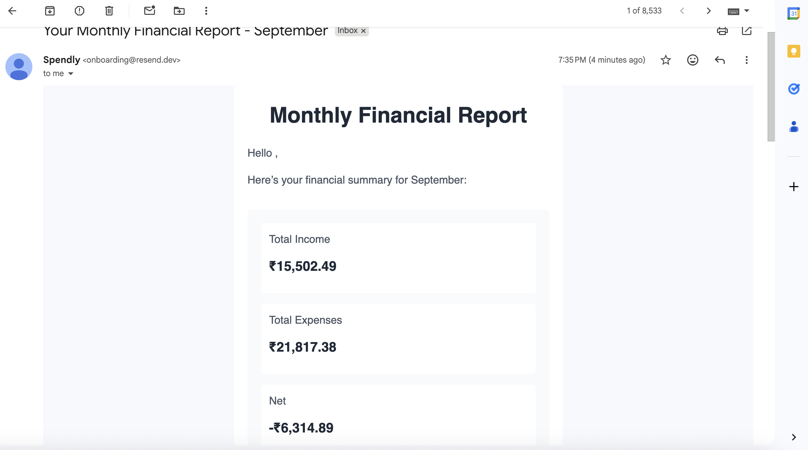
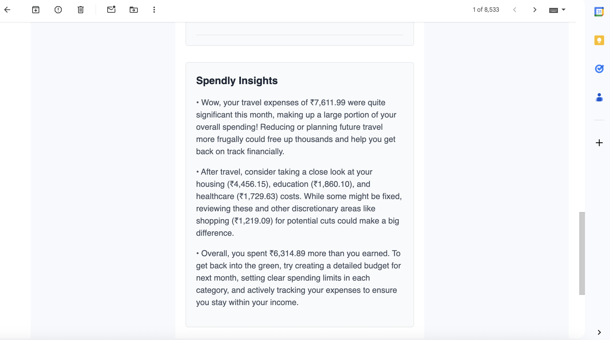

<h1 align="center">💰 Spendly - AI Powered Expense Tracker</h1>

<p align="center">
  Smart expense tracking with AI receipt scanning, monthly reports, and budget alerts.
</p>

## 🚀 Features

### 🧾 AI Receipt Scanner
Upload any receipt — Spendly’s AI automatically extracts the total, category, and date for you.
<p align="center">
  
</p>

### 📊 AI-Powered Monthly Reports
Visualize your spending patterns and get smart insights powered by AI.
<p align="center">
  
</p>
<p align="center">
  
</p>

### 💌 Budget Alerts via Email
Stay on track with personalized email alerts when you’re nearing your monthly budget.

## 🧰 Tech Stack

- **Frontend:** Next.js 15, React, TailwindCSS
- **Backend:** Next.js API Routes
- **AI:** Google Gemini
- **Database:** PostgreSQL
- **Email:** Resend API
- **Deployment:** Vercel


## Getting Started

First, run the development server:

```bash
npm run dev
# or
yarn dev
# or
pnpm dev
# or
bun dev
```

Open [http://localhost:3000](http://localhost:3000) with your browser to see the result.
